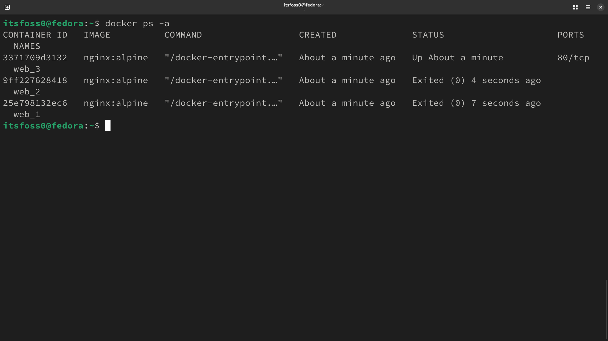
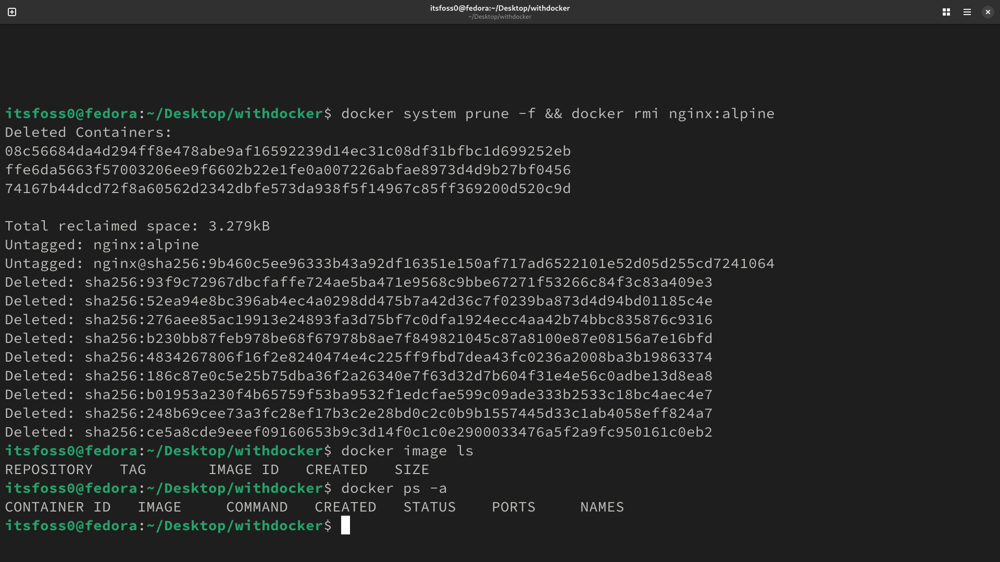
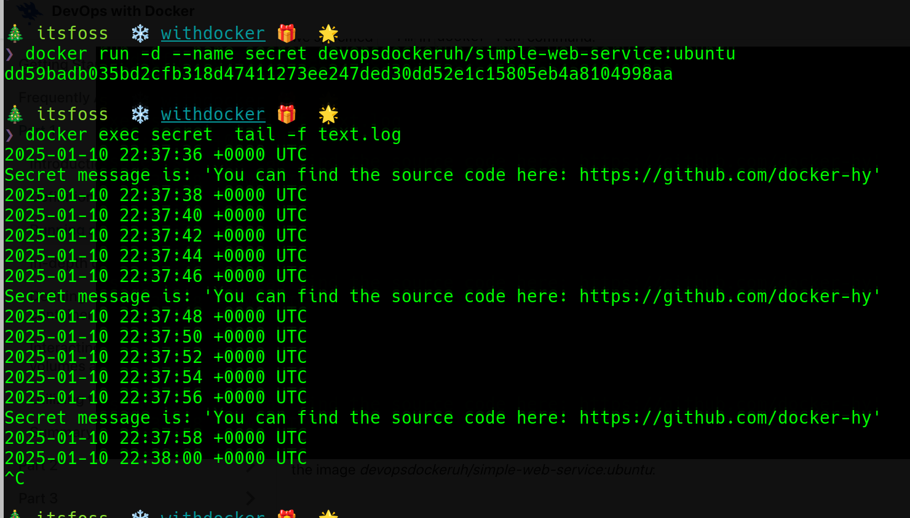
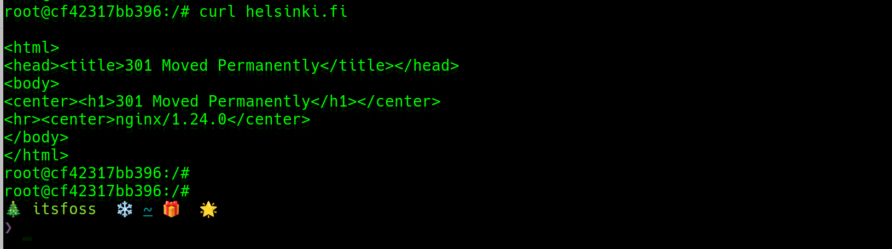
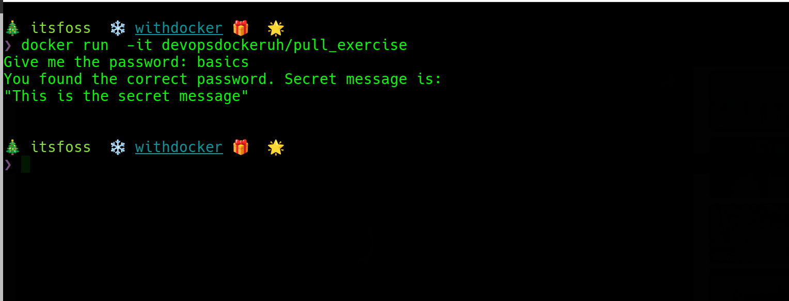
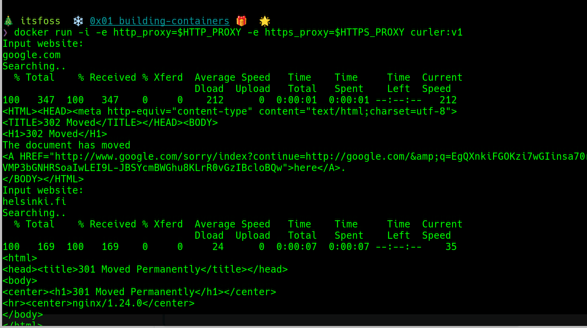
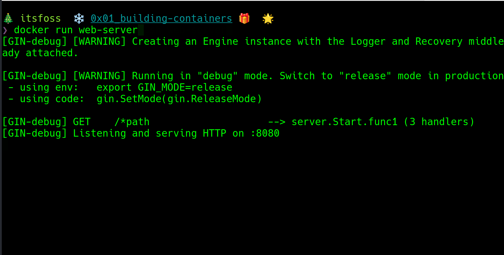

## Exercise 1.1: Getting started

Running three nginx containers and then stoping two of them


## Exercises 1.2 Cleanup

Removing all docker containers and images from the docker deamon.



## Exercise 1.3: Secret message

The secret is

> _*You can find the source code here: https://github.com/docker-hy*_



## Exercises 1.4

Start an ubuntu container to listen for url to curl

```bash
docker run -i ubuntu --name server sh -c 'while true; do echo "Input website:"; read website; echo "Searching.."; sleep 1; curl http://$website; done'
```

Install curl on the container by spawning another process

```bash
docker exec server apt-get update && apt-get install curl --yes
```



## Exercise 1.6: Hello Docker Hub



The secret message is

> "This is the secret message"

The password is _basics_

## Exercise 1.7: Image for script

Build and run a curler image



## Exercise 1.8: Two line Dockerfile

Using devopsdockeruh/simple-web-service:alpine as a base image for an image

The following screenshot shows the image built on from the `devopsdockeruh/simple-web-service:alpine`
running a web service without any arguments being passed. The  for this image is relative short as it only has two lines


```dockerfile
FROM devopsdockeruh/simple-web-service:alpine 
CMD  server
```

