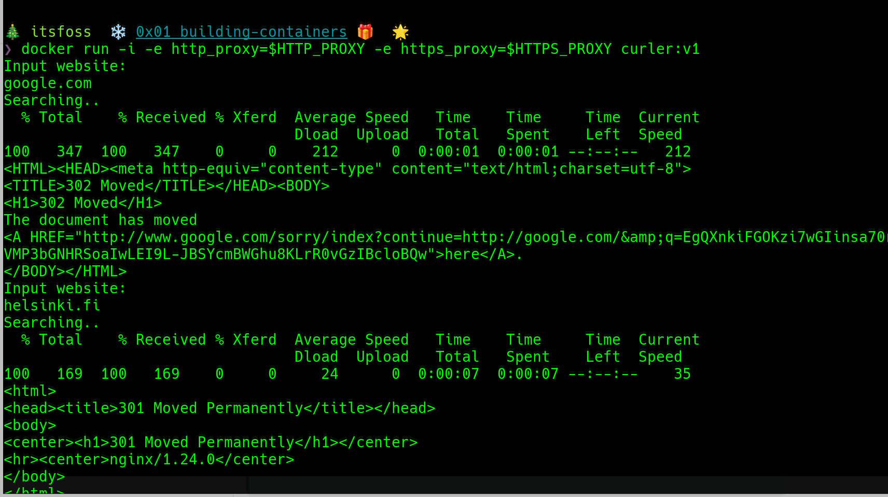

## Building containers

Here is the curler container in action

Side note:

> The proxy.conf file is used to configure apt to work behind a http proxy
> Just like the container was ran with http_proxy env variables to enable
> curl to work through the proxy as well.
