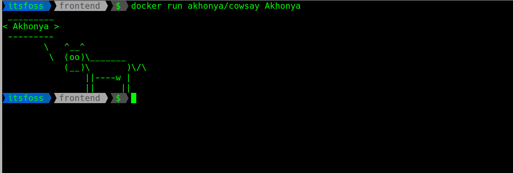

## Cowsay

Cowsay is a command-line utility that creates ASCII art images of cows saying messages
This is docker image with the same functionality

Here is cowsay in action



Running the container

```
docker run akhonya/cowsay <message>
```

If no message is passed, it will print 'Hello' 
